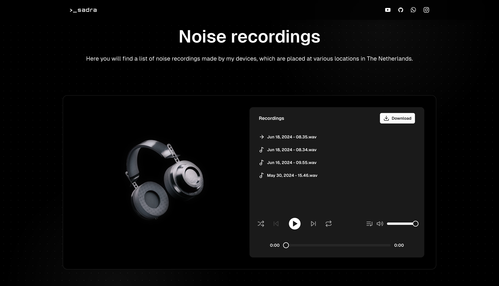
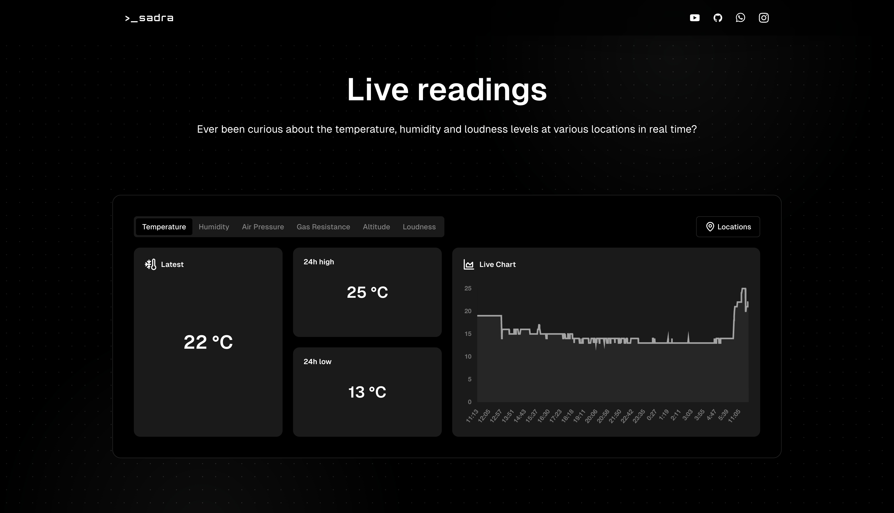
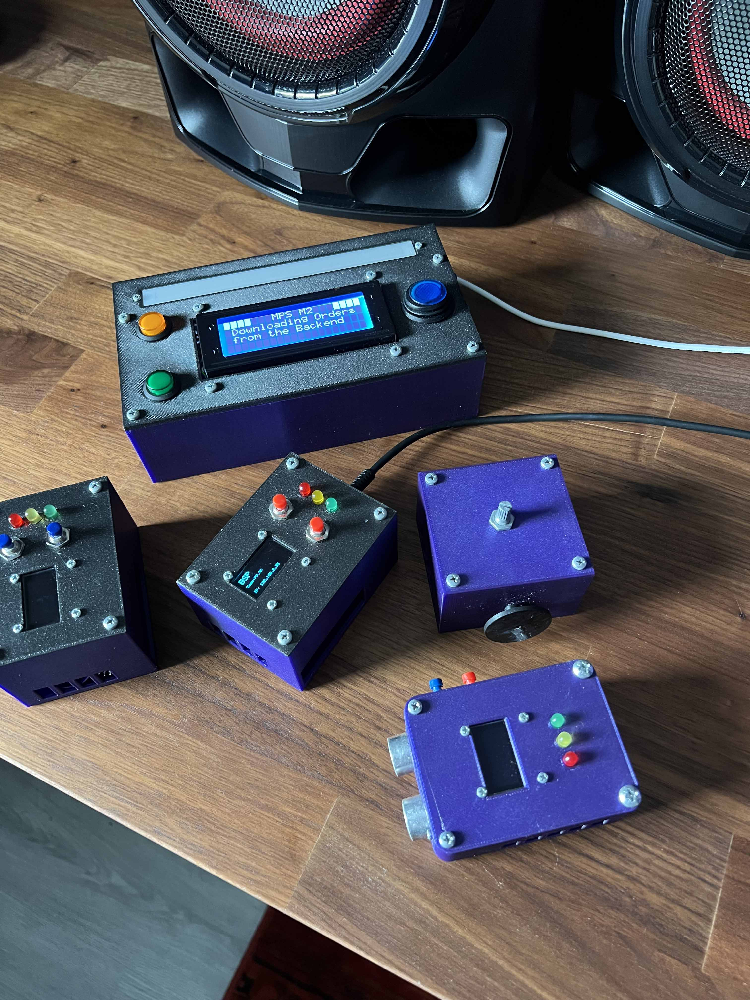
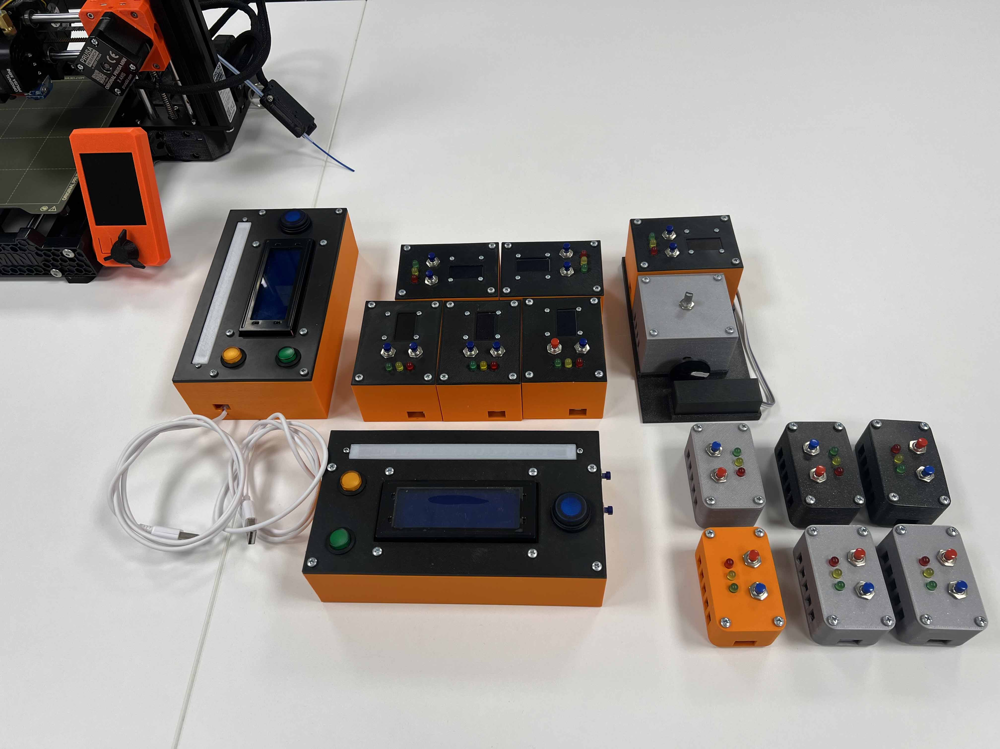
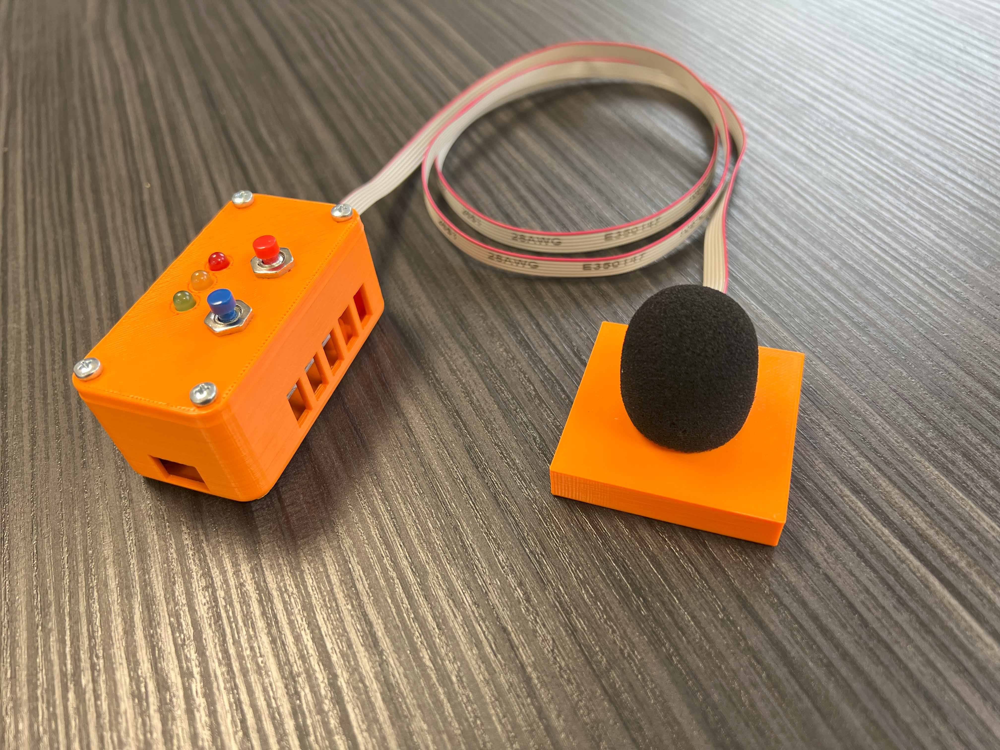
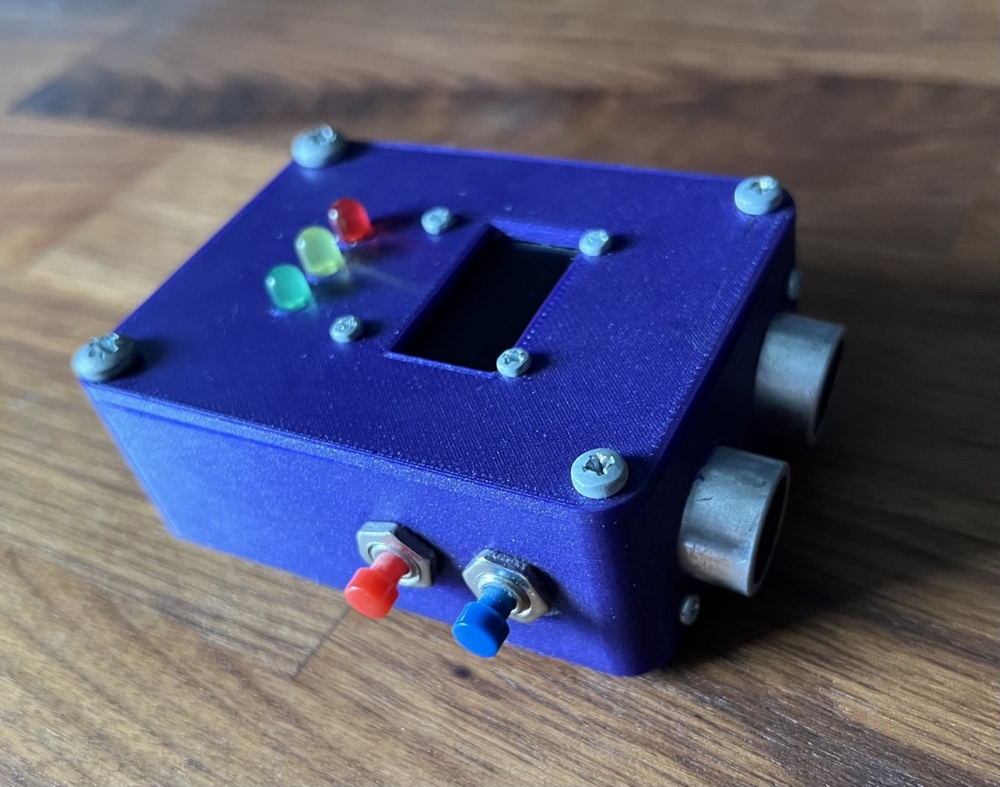
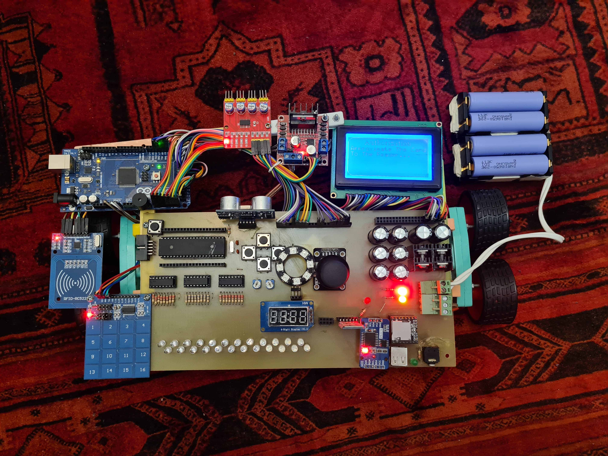

Hi, my name is Sadra.

I'm a full-stack developer based in Rijswijk, The Netherlands. I have always been passionate about building cool robots and apps.

Checkout my [Website](https://sadra.nl), [YouTube](https://youtube.com/@SadraShameli) and [Linkedin](https://linkedin.com/in/sadrashameli)

---

### 👨‍💻 What I do

- **Recent Projects**
  - [**sadra.nl**](https://github.com/SadraShameli/sadra.nl) - My personal portfolio
  - [**Resume**](https://github.com/SadraShameli/Resume) - Resume generator
  - [**Partify**](https://github.com/SadraShameli/Partify) - Online e-commerce store
  - [**SensorHub**](https://github.com/SadraShameli/SensorHub) - Devices that communicate to [sadra.nl](https://sadra.nl)
  - [**ProjectAI**](https://github.com/SadraShameli/ProjectAI) - Autonomous self-driving robot based on camera vision and lidar
  - [**SpotDL**](https://github.com/SadraShameli/spotdl) - Python script for downloading Spotify songs
- **Documents**
  - [**Curriculum Vitae**](Documents/CV.pdf "Curriculum Vitae")
  - [**Letter of Recommendation**](Documents/Letter%20of%20Recommendation.pdf "Letter of Recommendation")
  - [**Profielwerkstuk**](Documents/PWS%20-%20Artificial%20Intelligence.pdf "PWS - Artificial Intelligence") - Research for Project A.I.
- **Fun fact** - My name is always mistaken with **Sandra**.

---

### 💻 Tech Stack

These are my favorite tech stack for building all kinds of stuff.

- **Frontend** - TypeScript, React, Next.js, Tailwind CSS, shadcn/ui, Daisy UI, Material UI
- **Backend** - tRPC, Drizzle, Prisma, NextAuth.js, ASP.NET, Entity Framework
- **Databases** - PostgreSQL, SQL Server
- **Embedded** - C/C++, Python on ESP32 & Arduino
- **Embedded Tools** - Fusion 360, PrusaSlicer, Ultimaker Cura
- **3D Printers** - Prusa i3 MK3S+, Prusa Mini+, Vertex K8400

---

### 🌐 My Projects

  
<b>sadra.nl</b>

  
  

 

  
<b>Project A.I.</b>

  

 

  
<b>Sensor Hub</b>

  
  
  

 

  
<b>Social Robot</b>

  

 

  
<b>Robot</b>

  

