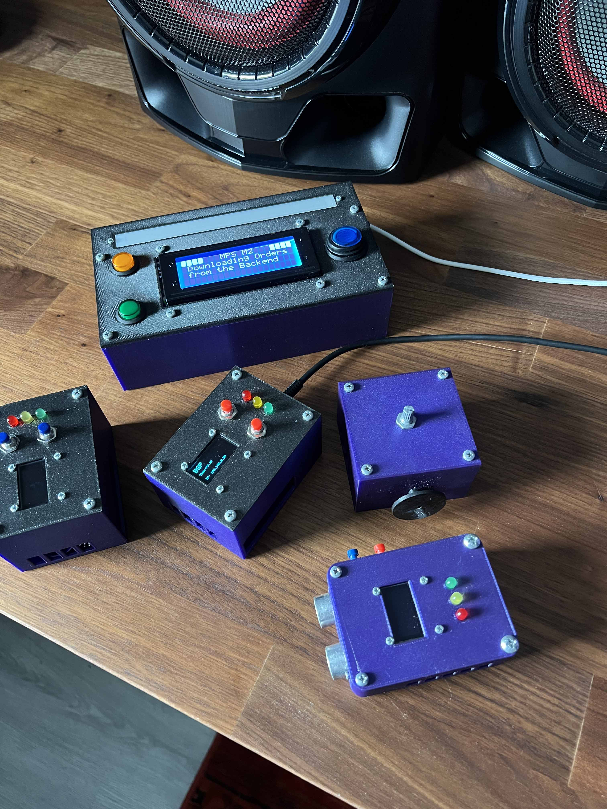
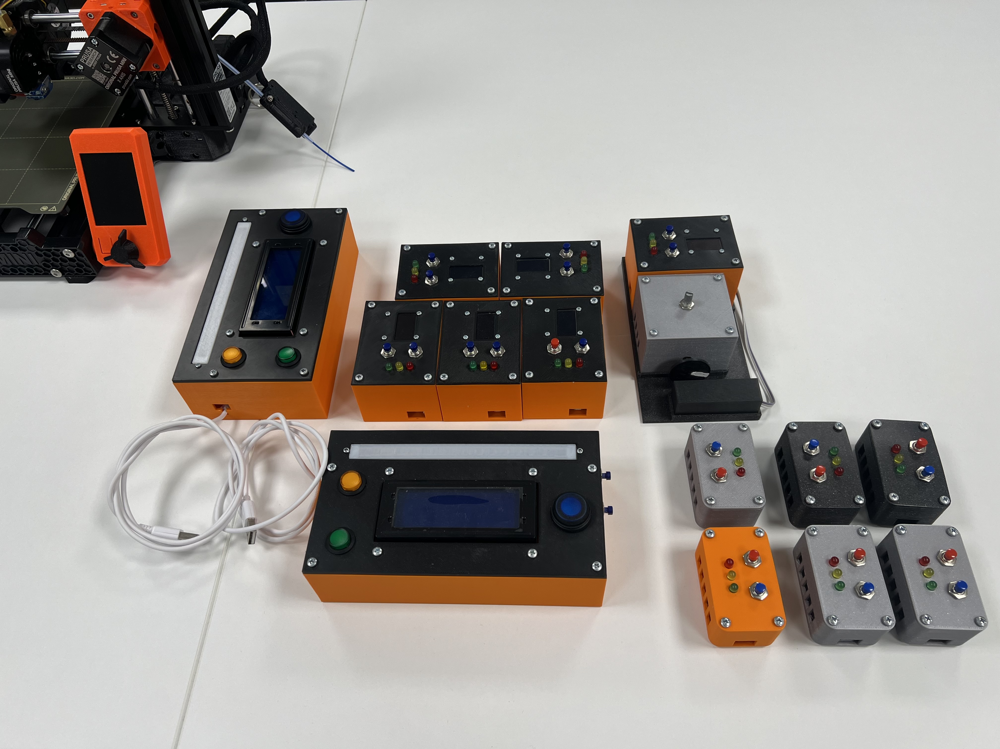
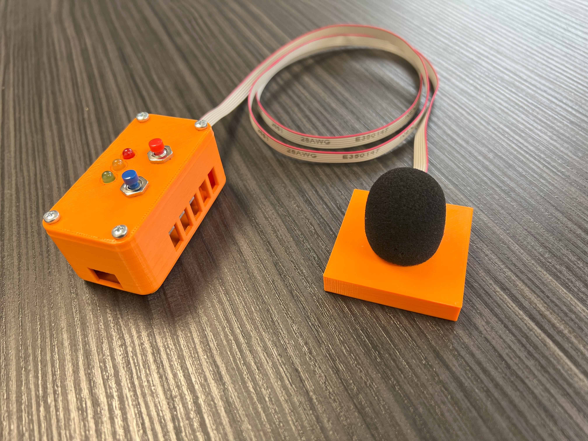

I'm Sadra Shameli. 20 years old full-stack & IoT developer based in Rotterdam, The Netherlands.

         
      
      

---

### 👨‍💻 What I do

- **I’m currently working on**
  - [**sadra.nl**](https://sadra.nl) - My personal website and resume
  - [**Resume**](https://github.com/SadraShameli/Resume) - Resume generator
  - [**Partify**](https://github.com/SadraShameli/Partify) - Online e-commerce store
  - [**ProjectAI**](https://github.com/SadraShameli/ProjectAI) - Autonomous self-driving robot based on camera vision and lidar
  - [**ProjectGameEngine**](https://github.com/SadraShameli/ProjectGameEngine) - Realtime game engine based on DirectX 12
- **Documents**
  - [**Curriculum Vitae**](Documents/CV.pdf "Curriculum Vitae")
  - [**Letter of Recommendation**](Documents/Letter%20of%20Recommendation.pdf "Letter of Recommendation")
  - [**Profielwerkstuk**](Documents/PWS%20-%20Artificial%20Intelligence.pdf "PWS - Artificial Intelligence") - Research document for Project A.I.
- **Fun fact** - My name is always mistaken with 'Sandra'.

---

### 💻 Tech Stack

These are my favorite tech stack for building all kinds of stuff.

- **Frontend** - TypeScript, React, Next.js, Tailwind CSS, shadcn/ui, Daisy UI, Material UI
- **Backend** - tRPC, Drizzle, Prisma, NextAuth.js, ASP.NET, Django, DRF
- **Databases** - PostgreSQL, SQL Server
- **Embedded** - C/C++, Python on ESP32 & Arduino
- **Embedded Tools** - Fusion 360, PrusaSlicer, Ultimaker Cura
- **3D Printers** - Prusa i3 MK3S+, Prusa Mini+, Vertex K8400

---

### 🌐 My Projects

 

