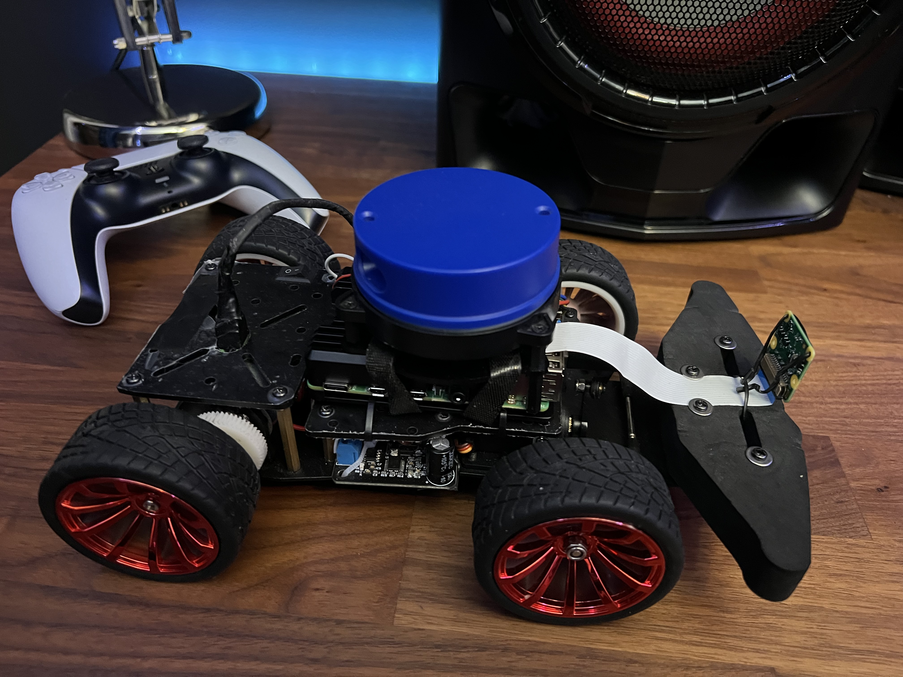
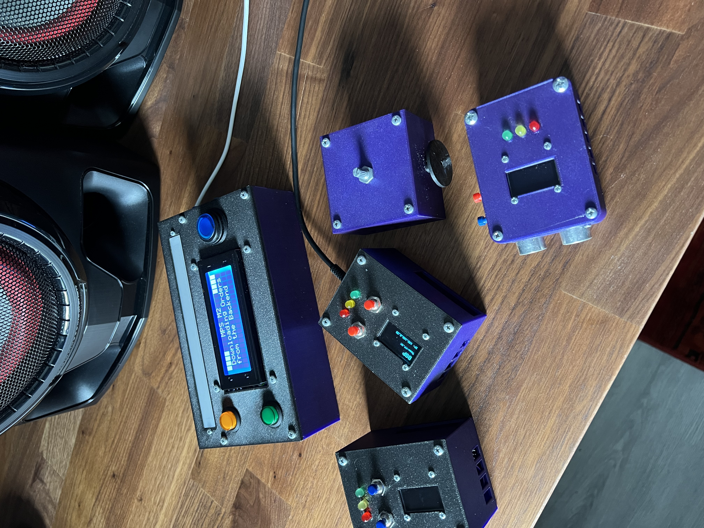
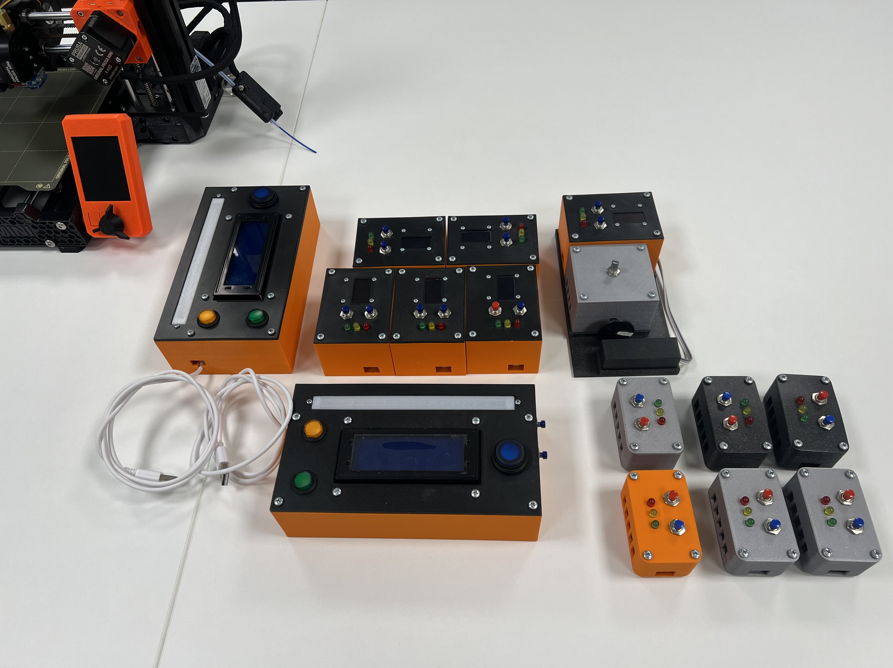
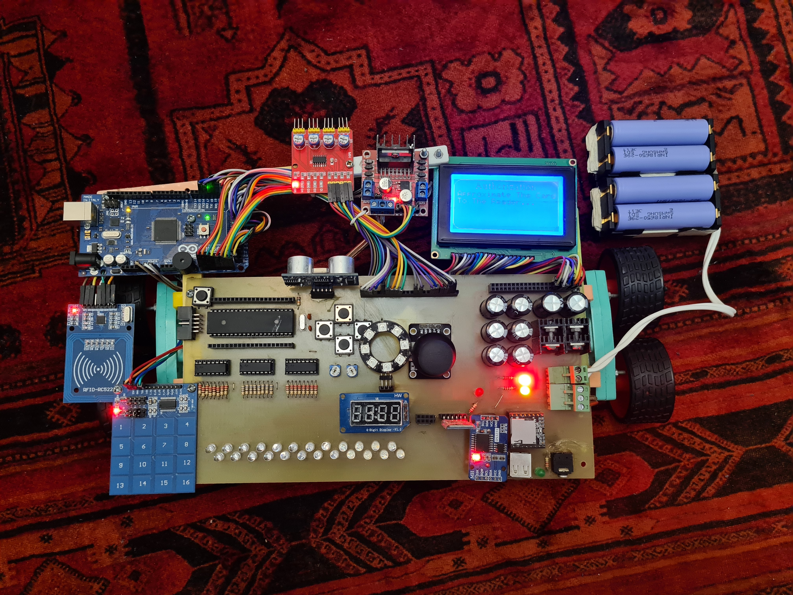

My name is Sadra Shameli and I'm an 19 y.o Back-End & Embedded Developer based in Rotterdam, The Netherlands.

      
      
   
      

---

### 👨‍💻 What I do
   * **I’m currently working on**
      * [ProjectAI](https://github.com/SadraShameli/ProjectAI) - Autonomous self-driving robot based on camera vision and lidar
      * [ProjectGameEngine](https://github.com/leonardssh/leonard.sh) - Realtime game engine based on DirectX 12
   * **Fun fact** - My name is always mistaken with 'Sandra'.

---

### 💻 Tech Stack
These are my favorite tech stack for building all kinds of stuff.

   * **Backend** - C#, ASP.NET
   * **Frontend** - TypeScript, React.js, Next.js, Material UI
   * **Scripting** - Python3, Bash
   * **Database** - SQL Server   
   * **Tools** - Azure DevOps, SQL Server, Azure Data Studio   
   * **Embedded** - C/C++, Python3, MicroPython   
   * **3D Printers** - Prusa i3 MK3S+, Prusa Mini+, Vertex K8400
   * **Embedded Tools** - Fusion 360, PrusaSlicer, Ultimaker Cura, Altium, Proteus

---

### 🌐 My Projects

 

