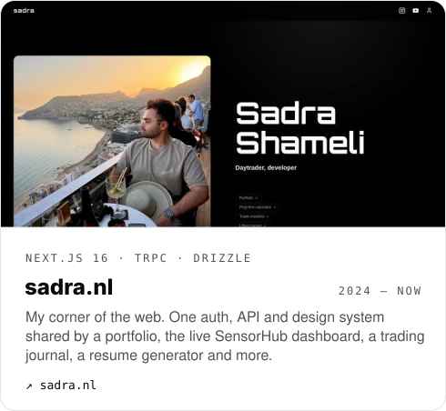
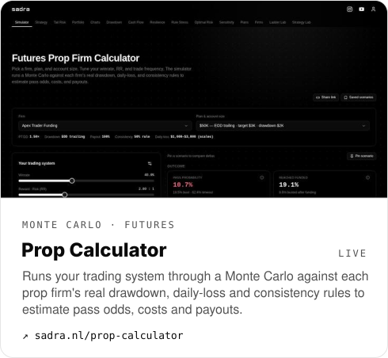
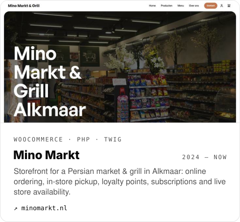
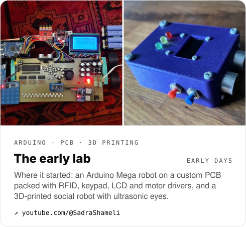

<!--

      ██╗
      ╚██╗       hey, you're reading the source. i like you already.
       ╚██╗
       ██╔╝      every graphic on this page is generated by a little
      ██╔╝       stdlib python in Scripts/readme, fonts and all.
      ╚═╝
           ███████╗
           ╚══════╝  find a bug? i owe you a coffee. sadra.shameli1@gmail.com

-->

<a href="https://sadra.nl">
  <picture>
    <source media="(prefers-color-scheme: dark)" srcset="Assets/Readme/hero-dark.svg">
    
  </picture>
</a>

<p align="center">
  <a href="https://sadra.nl"><kbd> ↗ sadra.nl </kbd></a>&nbsp;
  <a href="https://linkedin.com/in/sadrashameli"><kbd> LinkedIn </kbd></a>&nbsp;
  <a href="https://youtube.com/@SadraShameli"><kbd> YouTube </kbd></a>&nbsp;
  <a href="mailto:sadra.shameli1@gmail.com"><kbd> Email </kbd></a>&nbsp;
  <a href="Documents/Resume%20-%20Sadra.pdf"><kbd> Resume.pdf </kbd></a>
</p>

Hey, I'm Sadra 👋 (yes, **Sadra**, not Sandra).

I like owning things end to end: C++ firmware on an ESP32, the Next.js dashboard that plots what it measures, and the CI that keeps both honest. By day I'm a full-stack developer at [Nobears](https://www.nobears.com) in Rotterdam, where I ship and maintain 15+ WordPress platforms. The rest of the time I trade NQ futures, and I'm teaching a Python engine to do it with me.

<picture>
  <source media="(prefers-color-scheme: dark)" srcset="Assets/Readme/about-dark.svg">
  
</picture>

<details>
<summary><b>👔 I'm hiring. Give me the 30-second version.</b></summary>
<br>

- **4+ years in production.** Next.js, React, TypeScript and PHP/WordPress at [Nobears](https://www.nobears.com) (2024 to now), React, ASP.NET and IoT at [Blue Star Planning](https://bluestarplanning.com) (2021 to 2023).
- **End-to-end ownership.** I designed the 3D-printed devices, their firmware, the backend that ingests their data and the frontend that shows it. At Blue Star Planning I set up the Azure DevOps CI/CD pipeline the team still ships with.
- **I build tools that make teams faster.** My reusable component library at Nobears saves roughly 1 to 2 days on every new project.
- **Based in Rijswijk, NL.** [Resume (full-stack)](Documents/Resume%20-%20Sadra.pdf) · [Resume (quant)](Documents/Resume%20-%20Sadra%202.pdf) · [Letter of recommendation](Documents/Letter%20of%20Recommendation.pdf) · [sadra.shameli1@gmail.com](mailto:sadra.shameli1@gmail.com)

</details>

<details>
<summary><b>🧑‍💻 I'm a developer. Show me the interesting bits.</b></summary>
<br>

- **SensorHub records the loud moments.** It keeps a 5-second pre-roll ring buffer, encodes audio with a [hand-written IMA-ADPCM encoder](https://github.com/SadraShameli/sensorhub/blob/main/include/AdpcmRecorder.h) (4:1), and streams the WAV over HTTPS *while it's still recording*.
- **Firmware as a service manifest.** Every module declares its run mode, stack, priority and start condition, and a [tiny kernel](https://github.com/SadraShameli/sensorhub/blob/main/src/core/Kernel.cpp) boots the lot as FreeRTOS tasks. The core is header-only, so its 30 unit tests run on a PC.
- **Type safety from Postgres to pixels.** [sadra.nl](https://github.com/SadraShameli/sadra.nl) runs on Drizzle, Zod and tRPC, with Vitest and Playwright gating every deploy and Sentry watching production.
- **A backtest has to earn its way into production.** TradingBot's strategies go through walk-forward validation, Monte Carlo and Bayesian optimisation before they touch real money.
- **This README is a build artifact.** The SVGs are generated by [`Scripts/readme`](Scripts/readme) using only the Python standard library, with fonts subset and embedded so they render the same everywhere.

</details>

<details>
<summary><b>🤖 I'm a robot.</b></summary>
<br>

```json
{
  "name": "Sadra Shameli",
  "not": "Sandra",
  "location": "Rijswijk, NL",
  "roles": ["full-stack developer", "futures trader", "hardware tinkerer"],
  "stack": ["TypeScript", "Python", "C++", "PHP", "SQL"],
  "links": {
    "site": "https://sadra.nl",
    "linkedin": "https://linkedin.com/in/sadrashameli",
    "youtube": "https://youtube.com/@SadraShameli"
  },
  "status": 200
}
```

</details>

<details>
<summary><b>🙋 I'm looking for Sandra.</b></summary>
<br>

Wrong profile, but honestly, I get that a lot. Good luck finding her. 💛

</details>

## 🛠️ Things I've built

<a href="https://github.com/SadraShameli/sensorhub">
  <picture>
    <source media="(prefers-color-scheme: dark)" srcset="Assets/Readme/project-sensorhub-dark.svg">
    
  </picture>
</a>

<a href="Documents/Resume%20-%20Sadra%202.pdf">
  <picture>
    <source media="(prefers-color-scheme: dark)" srcset="Assets/Readme/project-tradingbot-dark.svg">
    
  </picture>
</a>

<a href="https://github.com/SadraShameli/ProjectAI">
  <picture>
    <source media="(prefers-color-scheme: dark)" srcset="Assets/Readme/project-projectai-dark.svg">
    
  </picture>
</a>

<p>
  <a href="https://sadra.nl"><picture><source media="(prefers-color-scheme: dark)" srcset="Assets/Readme/tile-sadra-nl-dark.svg"></picture></a>
  <a href="https://sadra.nl/prop-calculator"><picture><source media="(prefers-color-scheme: dark)" srcset="Assets/Readme/tile-prop-calculator-dark.svg"></picture></a>
</p>
<p>
  <a href="https://minomarkt.nl"><picture><source media="(prefers-color-scheme: dark)" srcset="Assets/Readme/tile-minomarkt-dark.svg"></picture></a>
  <a href="https://youtube.com/@SadraShameli"><picture><source media="(prefers-color-scheme: dark)" srcset="Assets/Readme/tile-lab-dark.svg"></picture></a>
</p>

<sub>🔒 TradingBot is private because it trades real money. Happy to walk you through the architecture on a call. · 🧊 Want to hold a SensorHub? <a href="https://github.com/SadraShameli/sensorhub/blob/main/Assets/3D%20Models/Sensor%20Unit/Casing%20body.stl">Spin its enclosure in 3D</a>.</sub>

## 🧰 Stack

<picture>
  <source media="(prefers-color-scheme: dark)" srcset="Assets/Readme/stack-dark.svg">
  
</picture>

## 🎬 On YouTube

<table>
  <tr>
    <td width="33%"><a href="https://www.youtube.com/watch?v=1142rRZ3rzc"></a><br><sub><b>Line detection</b> for Project A.I., based on contrast difference</sub></td>
    <td width="33%"><a href="https://www.youtube.com/watch?v=_C8PnLK2SWA"></a><br><sub><b>Range detection</b> with lidar, so the robot knows what's in front of it</sub></td>
    <td width="33%"><a href="https://www.youtube.com/shorts/abyVlfAETG0"></a><br><sub><b>First indoor test drive</b>, fully autonomous</sub></td>
  </tr>
</table>

## 📄 Paper trail

- 📄 [**Resume, full-stack**](Documents/Resume%20-%20Sadra.pdf): web, CMS and IoT work, 2021 to now
- 📈 [**Resume, quant**](Documents/Resume%20-%20Sadra%202.pdf): the trading and TradingBot angle
- ✉️ [**Letter of recommendation**](Documents/Letter%20of%20Recommendation.pdf): in someone else's words
- 🎓 [**Profielwerkstuk: Artificial Intelligence**](Documents/PWS%20-%20Artificial%20Intelligence.pdf): my 95-page school thesis (in Dutch) behind Project A.I., covering languages, compilers, TensorFlow, Raspberry Pi and ESP32

<br>

<picture>
  <source media="(prefers-color-scheme: dark)" srcset="Assets/Readme/footer-dark.svg">
  
</picture>
