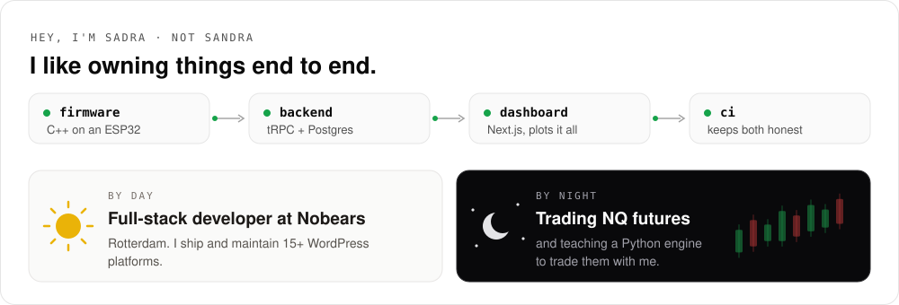
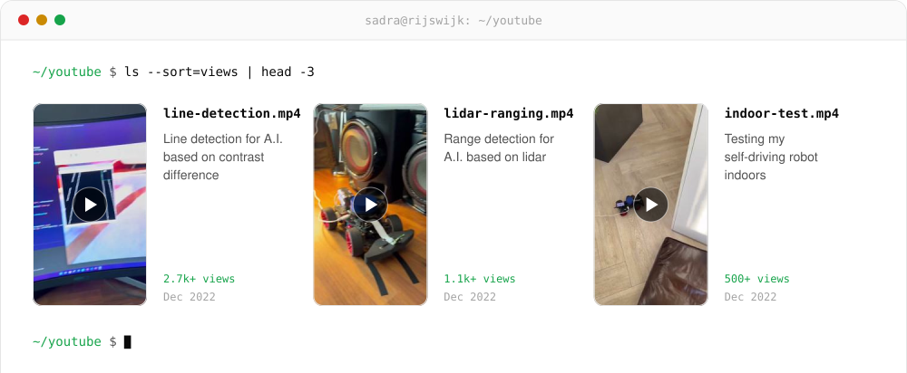
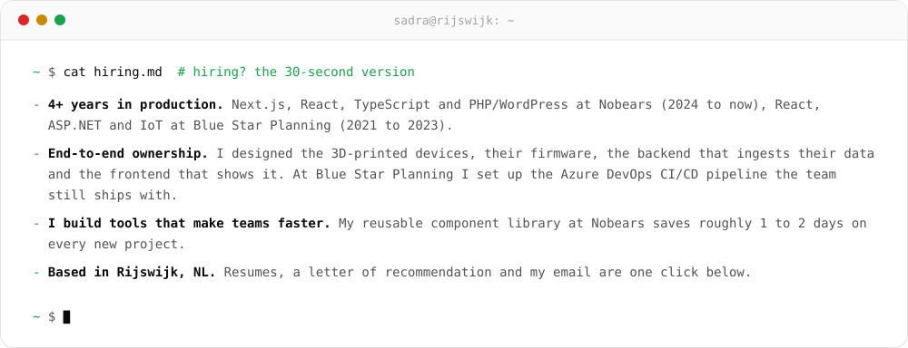
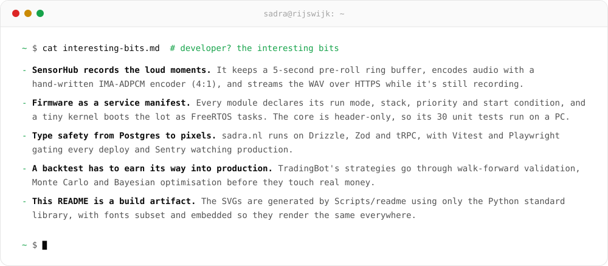
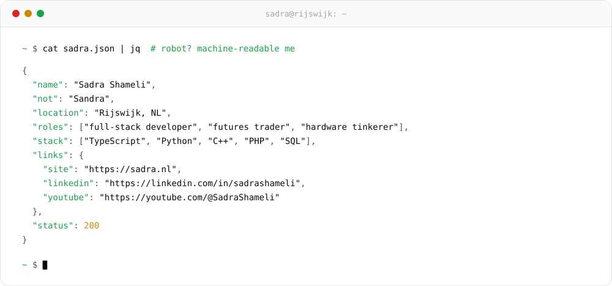
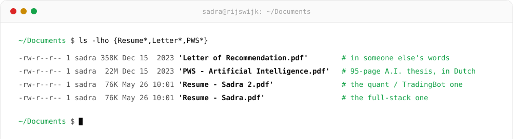

<!--

      ██╗
      ╚██╗       hey, you're reading the source. i like you already.
       ╚██╗
       ██╔╝      every graphic on this page is generated by a little
      ██╔╝       stdlib python in Scripts/readme, fonts and all.
      ╚═╝
           ███████╗
           ╚══════╝  find a bug? i owe you a coffee. sadra.shameli1@gmail.com

-->

<a href="https://sadra.nl">
  <picture>
    <source media="(prefers-color-scheme: dark)" srcset="Assets/Readme/hero-dark.svg">
    
  </picture>
</a>

  <a href="https://sadra.nl"><kbd> ↗ sadra.nl </kbd></a>&nbsp;
  <a href="https://linkedin.com/in/sadrashameli"><kbd> LinkedIn </kbd></a>&nbsp;
  <a href="https://youtube.com/@SadraShameli"><kbd> YouTube </kbd></a>&nbsp;
  <a href="mailto:sadra.shameli1@gmail.com"><kbd> Email </kbd></a>&nbsp;
  <a href="Documents/Resume%20-%20Sadra.pdf"><kbd> Resume.pdf </kbd></a>

<picture>
  <source media="(prefers-color-scheme: dark)" srcset="Assets/Readme/intro-dark.svg">
  
</picture>

<picture>
  <source media="(prefers-color-scheme: dark)" srcset="Assets/Readme/about-dark.svg">
  
</picture>

 

<a href="https://github.com/SadraShameli/sensorhub">
  <picture>
    <source media="(prefers-color-scheme: dark)" srcset="Assets/Readme/project-sensorhub-dark.svg">
    
  </picture>
</a>

  <a href="https://github.com/SadraShameli/sensorhub/blob/main/Assets/3D%20Models/Sensor%20Unit/Casing%20body.stl"><kbd> 🧊 Spin the SensorHub enclosure in 3D ↗ </kbd></a>

<a href="Documents/Resume%20-%20Sadra%202.pdf">
  <picture>
    <source media="(prefers-color-scheme: dark)" srcset="Assets/Readme/project-tradingbot-dark.svg">
    
  </picture>
</a>

<a href="https://github.com/SadraShameli/ProjectAI">
  <picture>
    <source media="(prefers-color-scheme: dark)" srcset="Assets/Readme/project-projectai-dark.svg">
    
  </picture>
</a>

  <a href="https://sadra.nl"><picture><source media="(prefers-color-scheme: dark)" srcset="Assets/Readme/tile-sadra-nl-dark.svg"></picture></a>
  <a href="https://sadra.nl/prop-calculator"><picture><source media="(prefers-color-scheme: dark)" srcset="Assets/Readme/tile-prop-calculator-dark.svg"></picture></a>

  <a href="https://minomarkt.nl"><picture><source media="(prefers-color-scheme: dark)" srcset="Assets/Readme/tile-minomarkt-dark.svg"></picture></a>
  <a href="https://youtube.com/@SadraShameli"><picture><source media="(prefers-color-scheme: dark)" srcset="Assets/Readme/tile-lab-dark.svg"></picture></a>

 

<picture>
  <source media="(prefers-color-scheme: dark)" srcset="Assets/Readme/stack-dark.svg">
  
</picture>

 

<a href="https://youtube.com/@SadraShameli">
  <picture>
    <source media="(prefers-color-scheme: dark)" srcset="Assets/Readme/youtube-dark.svg">
    
  </picture>
</a>

  <a href="https://www.youtube.com/watch?v=1142rRZ3rzc"><kbd> ▶ Line detection </kbd></a>&nbsp;
  <a href="https://www.youtube.com/watch?v=_C8PnLK2SWA"><kbd> ▶ Lidar ranging </kbd></a>&nbsp;
  <a href="https://www.youtube.com/shorts/abyVlfAETG0"><kbd> ▶ Indoor test drive </kbd></a>&nbsp;
  <a href="https://youtube.com/@SadraShameli"><kbd> ↗ Channel </kbd></a>

 

<a href="Documents/Resume%20-%20Sadra.pdf">
<picture>
  <source media="(prefers-color-scheme: dark)" srcset="Assets/Readme/sh-hiring-dark.svg">
  
</picture>
</a>

  <a href="https://www.nobears.com"><kbd> Nobears </kbd></a>&nbsp;
  <a href="https://bluestarplanning.com"><kbd> Blue Star Planning </kbd></a>&nbsp;
  <a href="Documents/Resume%20-%20Sadra.pdf"><kbd> Resume · full-stack </kbd></a>&nbsp;
  <a href="Documents/Resume%20-%20Sadra%202.pdf"><kbd> Resume · quant </kbd></a>&nbsp;
  <a href="Documents/Letter%20of%20Recommendation.pdf"><kbd> Letter of recommendation </kbd></a>&nbsp;
  <a href="mailto:sadra.shameli1@gmail.com"><kbd> Email </kbd></a>

<a href="https://github.com/SadraShameli/sensorhub">
<picture>
  <source media="(prefers-color-scheme: dark)" srcset="Assets/Readme/sh-developer-dark.svg">
  
</picture>
</a>

  <a href="https://github.com/SadraShameli/sensorhub/blob/main/include/AdpcmRecorder.h"><kbd> IMA-ADPCM encoder </kbd></a>&nbsp;
  <a href="https://github.com/SadraShameli/sensorhub/blob/main/src/core/Kernel.cpp"><kbd> Service kernel </kbd></a>&nbsp;
  <a href="https://github.com/SadraShameli/sadra.nl"><kbd> sadra.nl source </kbd></a>&nbsp;
  <a href="Scripts/readme"><kbd> Scripts/readme </kbd></a>

<a href="https://sadra.nl">
<picture>
  <source media="(prefers-color-scheme: dark)" srcset="Assets/Readme/sh-robot-dark.svg">
  
</picture>
</a>

  <a href="https://sadra.nl"><kbd> sadra.nl </kbd></a>&nbsp;
  <a href="https://linkedin.com/in/sadrashameli"><kbd> LinkedIn </kbd></a>&nbsp;
  <a href="https://youtube.com/@SadraShameli"><kbd> YouTube </kbd></a>

<picture>
  <source media="(prefers-color-scheme: dark)" srcset="Assets/Readme/sh-sandra-dark.svg">
  
</picture>

 

<a href="Documents">
  <picture>
    <source media="(prefers-color-scheme: dark)" srcset="Assets/Readme/documents-dark.svg">
    
  </picture>
</a>

  <a href="Documents/Resume%20-%20Sadra.pdf"><kbd> Resume · full-stack </kbd></a>&nbsp;
  <a href="Documents/Resume%20-%20Sadra%202.pdf"><kbd> Resume · quant </kbd></a>&nbsp;
  <a href="Documents/Letter%20of%20Recommendation.pdf"><kbd> Letter of recommendation </kbd></a>&nbsp;
  <a href="Documents/PWS%20-%20Artificial%20Intelligence.pdf"><kbd> A.I. thesis (PWS) </kbd></a>

 

<picture>
  <source media="(prefers-color-scheme: dark)" srcset="Assets/Readme/footer-dark.svg">
  
</picture>
