<!--

      ██╗
      ╚██╗       hey, you're reading the source. i like you already.
       ╚██╗
       ██╔╝      every graphic on this page is generated by a little
      ██╔╝       stdlib python in Scripts/readme, fonts and all.
      ╚═╝
           ███████╗
           ╚══════╝  find a bug? i owe you a coffee. sadra.shameli1@gmail.com

-->

<a href="https://sadra.nl"><picture><source media="(prefers-color-scheme: dark)" srcset="Assets/Readme/hero-dark.svg"></picture></a> 
<a href="https://sadra.nl"><picture><source media="(prefers-color-scheme: dark)" srcset="Assets/Readme/dock/hero-0-0-dark.svg"></picture></a><a href="https://linkedin.com/in/sadrashameli"><picture><source media="(prefers-color-scheme: dark)" srcset="Assets/Readme/dock/hero-0-1-dark.svg">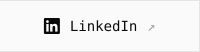</picture></a><a href="https://youtube.com/@SadraShameli"><picture><source media="(prefers-color-scheme: dark)" srcset="Assets/Readme/dock/hero-0-2-dark.svg">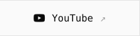</picture></a><a href="mailto:sadra.shameli1@gmail.com"><picture><source media="(prefers-color-scheme: dark)" srcset="Assets/Readme/dock/hero-0-3-dark.svg"></picture></a><a href="Documents/Resume%20-%20Sadra.pdf"><picture><source media="(prefers-color-scheme: dark)" srcset="Assets/Readme/dock/hero-0-4-dark.svg">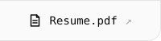</picture></a>

<picture>
  <source media="(prefers-color-scheme: dark)" srcset="Assets/Readme/intro-dark.svg">
  
</picture>

<picture>
  <source media="(prefers-color-scheme: dark)" srcset="Assets/Readme/about-dark.svg">
  
</picture>

 

<a href="https://github.com/SadraShameli/sensorhub"><picture><source media="(prefers-color-scheme: dark)" srcset="Assets/Readme/project-sensorhub-dark.svg"></picture></a> 
<a href="https://github.com/SadraShameli/sensorhub"><picture><source media="(prefers-color-scheme: dark)" srcset="Assets/Readme/dock/project-sensorhub-0-0-dark.svg"></picture></a><a href="https://github.com/SadraShameli/sensorhub/blob/main/Assets/3D%20Models/Sensor%20Unit/Casing%20body.stl"><picture><source media="(prefers-color-scheme: dark)" srcset="Assets/Readme/dock/project-sensorhub-0-1-dark.svg">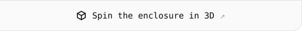</picture></a>

<a href="Documents/Resume%20-%20Sadra%202.pdf"><picture><source media="(prefers-color-scheme: dark)" srcset="Assets/Readme/project-tradingbot-dark.svg"></picture></a> 
<a href="Documents/Resume%20-%20Sadra%202.pdf"><picture><source media="(prefers-color-scheme: dark)" srcset="Assets/Readme/dock/project-tradingbot-0-0-dark.svg"></picture></a><a href="mailto:sadra.shameli1@gmail.com"><picture><source media="(prefers-color-scheme: dark)" srcset="Assets/Readme/dock/project-tradingbot-0-1-dark.svg">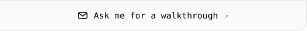</picture></a>

<a href="https://github.com/SadraShameli/ProjectAI"><picture><source media="(prefers-color-scheme: dark)" srcset="Assets/Readme/project-projectai-dark.svg"></picture></a> 
<a href="https://github.com/SadraShameli/ProjectAI"><picture><source media="(prefers-color-scheme: dark)" srcset="Assets/Readme/dock/project-projectai-0-0-dark.svg"></picture></a><a href="https://www.youtube.com/shorts/abyVlfAETG0"><picture><source media="(prefers-color-scheme: dark)" srcset="Assets/Readme/dock/project-projectai-0-1-dark.svg">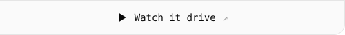</picture></a>

  <a href="https://sadra.nl"><picture><source media="(prefers-color-scheme: dark)" srcset="Assets/Readme/tile-sadra-nl-dark.svg"></picture></a>
  <a href="https://sadra.nl/prop-calculator"><picture><source media="(prefers-color-scheme: dark)" srcset="Assets/Readme/tile-prop-calculator-dark.svg"></picture></a>

  <a href="https://minomarkt.nl"><picture><source media="(prefers-color-scheme: dark)" srcset="Assets/Readme/tile-minomarkt-dark.svg"></picture></a>
  <a href="https://youtube.com/@SadraShameli"><picture><source media="(prefers-color-scheme: dark)" srcset="Assets/Readme/tile-lab-dark.svg"></picture></a>

 

<picture>
  <source media="(prefers-color-scheme: dark)" srcset="Assets/Readme/stack-dark.svg">
  
</picture>

 

<a href="https://youtube.com/@SadraShameli"><picture><source media="(prefers-color-scheme: dark)" srcset="Assets/Readme/youtube-dark.svg"></picture></a> 
<a href="https://www.youtube.com/watch?v=1142rRZ3rzc"><picture><source media="(prefers-color-scheme: dark)" srcset="Assets/Readme/dock/youtube-0-0-dark.svg">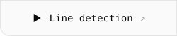</picture></a><a href="https://www.youtube.com/watch?v=_C8PnLK2SWA"><picture><source media="(prefers-color-scheme: dark)" srcset="Assets/Readme/dock/youtube-0-1-dark.svg">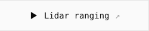</picture></a><a href="https://www.youtube.com/shorts/abyVlfAETG0"><picture><source media="(prefers-color-scheme: dark)" srcset="Assets/Readme/dock/youtube-0-2-dark.svg">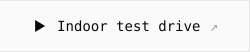</picture></a><a href="https://youtube.com/@SadraShameli"><picture><source media="(prefers-color-scheme: dark)" srcset="Assets/Readme/dock/youtube-0-3-dark.svg">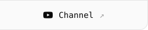</picture></a>

 

<a href="Documents/Resume%20-%20Sadra.pdf"><picture><source media="(prefers-color-scheme: dark)" srcset="Assets/Readme/sh-hiring-dark.svg"></picture></a> 
<a href="https://www.nobears.com"><picture><source media="(prefers-color-scheme: dark)" srcset="Assets/Readme/dock/sh-hiring-0-0-dark.svg"></picture></a><a href="https://bluestarplanning.com"><picture><source media="(prefers-color-scheme: dark)" srcset="Assets/Readme/dock/sh-hiring-0-1-dark.svg">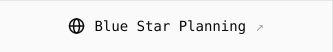</picture></a><a href="mailto:sadra.shameli1@gmail.com"><picture><source media="(prefers-color-scheme: dark)" srcset="Assets/Readme/dock/sh-hiring-0-2-dark.svg">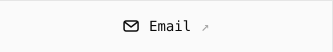</picture></a> 
<a href="Documents/Resume%20-%20Sadra.pdf"><picture><source media="(prefers-color-scheme: dark)" srcset="Assets/Readme/dock/sh-hiring-1-0-dark.svg">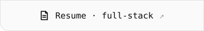</picture></a><a href="Documents/Resume%20-%20Sadra%202.pdf"><picture><source media="(prefers-color-scheme: dark)" srcset="Assets/Readme/dock/sh-hiring-1-1-dark.svg">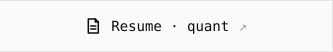</picture></a><a href="Documents/Letter%20of%20Recommendation.pdf"><picture><source media="(prefers-color-scheme: dark)" srcset="Assets/Readme/dock/sh-hiring-1-2-dark.svg"></picture></a>

<a href="https://github.com/SadraShameli/sensorhub"><picture><source media="(prefers-color-scheme: dark)" srcset="Assets/Readme/sh-developer-dark.svg"></picture></a> 
<a href="https://github.com/SadraShameli/sensorhub/blob/main/include/AdpcmRecorder.h"><picture><source media="(prefers-color-scheme: dark)" srcset="Assets/Readme/dock/sh-developer-0-0-dark.svg"></picture></a><a href="https://github.com/SadraShameli/sensorhub/blob/main/src/core/Kernel.cpp"><picture><source media="(prefers-color-scheme: dark)" srcset="Assets/Readme/dock/sh-developer-0-1-dark.svg">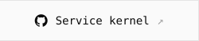</picture></a><a href="https://github.com/SadraShameli/sadra.nl"><picture><source media="(prefers-color-scheme: dark)" srcset="Assets/Readme/dock/sh-developer-0-2-dark.svg">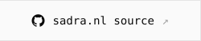</picture></a><a href="Scripts/readme"><picture><source media="(prefers-color-scheme: dark)" srcset="Assets/Readme/dock/sh-developer-0-3-dark.svg">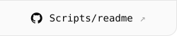</picture></a>

<a href="https://sadra.nl"><picture><source media="(prefers-color-scheme: dark)" srcset="Assets/Readme/sh-robot-dark.svg"></picture></a> 
<a href="https://sadra.nl"><picture><source media="(prefers-color-scheme: dark)" srcset="Assets/Readme/dock/sh-robot-0-0-dark.svg">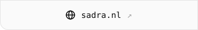</picture></a><a href="https://linkedin.com/in/sadrashameli"><picture><source media="(prefers-color-scheme: dark)" srcset="Assets/Readme/dock/sh-robot-0-1-dark.svg">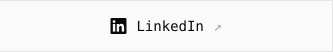</picture></a><a href="https://youtube.com/@SadraShameli"><picture><source media="(prefers-color-scheme: dark)" srcset="Assets/Readme/dock/sh-robot-0-2-dark.svg">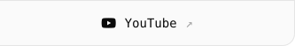</picture></a>

<picture>
  <source media="(prefers-color-scheme: dark)" srcset="Assets/Readme/sh-sandra-dark.svg">
  
</picture>

 

<a href="Documents"><picture><source media="(prefers-color-scheme: dark)" srcset="Assets/Readme/documents-dark.svg"></picture></a> 
<a href="Documents/Resume%20-%20Sadra.pdf"><picture><source media="(prefers-color-scheme: dark)" srcset="Assets/Readme/dock/documents-0-0-dark.svg">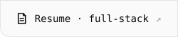</picture></a><a href="Documents/Resume%20-%20Sadra%202.pdf"><picture><source media="(prefers-color-scheme: dark)" srcset="Assets/Readme/dock/documents-0-1-dark.svg"></picture></a><a href="Documents/Letter%20of%20Recommendation.pdf"><picture><source media="(prefers-color-scheme: dark)" srcset="Assets/Readme/dock/documents-0-2-dark.svg"></picture></a><a href="Documents/PWS%20-%20Artificial%20Intelligence.pdf"><picture><source media="(prefers-color-scheme: dark)" srcset="Assets/Readme/dock/documents-0-3-dark.svg"></picture></a>

 

<picture>
  <source media="(prefers-color-scheme: dark)" srcset="Assets/Readme/footer-dark.svg">
  
</picture>

